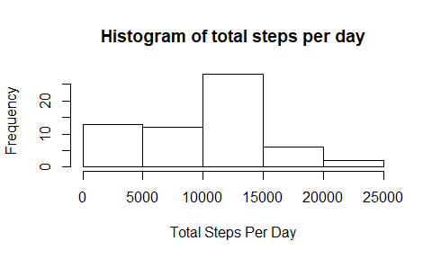
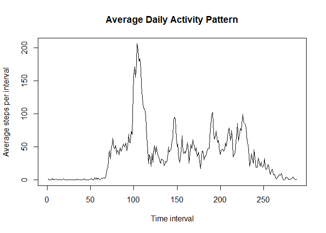
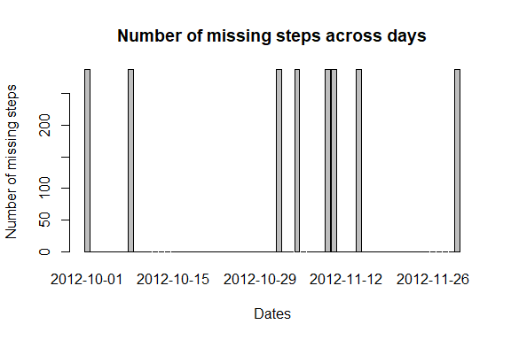
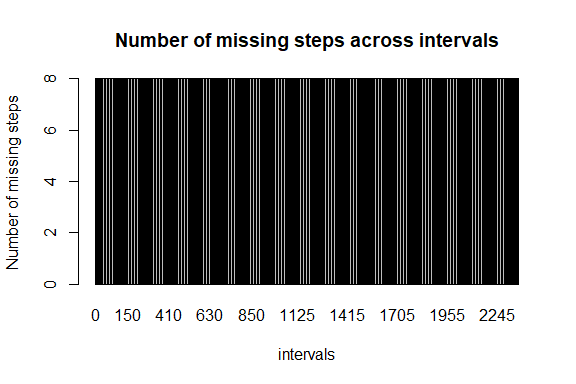
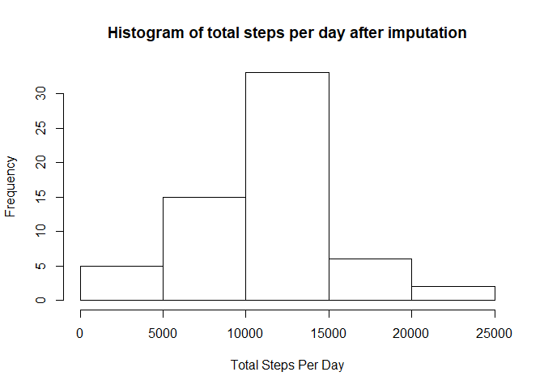
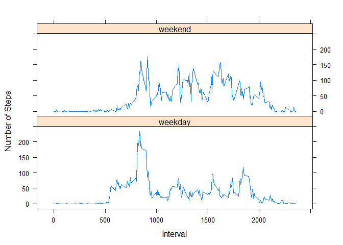

## Loading and preprocessing the data
### 1.Load and read the data.

```r
  if(!file.exists("activity.csv"))
  {
    unzip("activity.zip")
  }

  activity_data<-read.csv("activity.csv",stringsAsFactors = FALSE)
```
Take a look at the summary of the data

```r
    summary(activity_data)
```

```
##      steps            date              interval     
##  Min.   :  0.00   Length:17568       Min.   :   0.0  
##  1st Qu.:  0.00   Class :character   1st Qu.: 588.8  
##  Median :  0.00   Mode  :character   Median :1177.5  
##  Mean   : 37.38                      Mean   :1177.5  
##  3rd Qu.: 12.00                      3rd Qu.:1766.2  
##  Max.   :806.00                      Max.   :2355.0  
##  NA's   :2304
```
Have a look at the first few records.

```r
    head(activity_data)
```

```
##   steps       date interval
## 1    NA 2012-10-01        0
## 2    NA 2012-10-01        5
## 3    NA 2012-10-01       10
## 4    NA 2012-10-01       15
## 5    NA 2012-10-01       20
## 6    NA 2012-10-01       25
```

## What is mean total number of steps taken per day?
### 1.Calculate the total number of steps taken per day


```r
    total_steps_per_day<-tapply(activity_data$steps,as.factor(activity_data$date),sum,na.rm=TRUE)
```
### 2.Make a histogram of the total number of steps taken each day.


```r
    hist(total_steps_per_day,xlab = "Total Steps Per Day", main = "Histogram of total steps per day")
```

<!-- -->

### 3.Calculate and report the mean and median of the total number of steps taken per day


```r
    mean_total_steps_per_day<-mean(total_steps_per_day,na.rm=TRUE)
    median_total_steps_per_day<-median(total_steps_per_day,na.rm=TRUE)
```
The mean of the total number of steps taken per day is 9354.2295082.  
The median of the total number of steps taken per day is 10395.

## What is the average daily activity pattern?

### 1.Make a time series plot (i.e. \color{red}{\verb|type = "l"|}type="l") of the 5-minute interval (x-axis) and the average number of steps taken, averaged across all days (y-axis)

```r
    average_steps_per_day<-tapply(activity_data$steps,as.factor(activity_data$interval),mean,na.rm=TRUE)

    plot(as.vector(average_steps_per_day),type="l",xlab = "Time interval",ylab = "Average steps per interval",main="Average Daily Activity Pattern")
```

<!-- -->

### 2.Which 5-minute interval, on average across all the days in the dataset, contains the maximum number of steps?


```r
interval_with_max_steps<-activity_data$interval[which.max(average_steps_per_day)]
```

The interval 835 contains the maximum number of steps.

## Imputing missing values

### 1.Calculate and report the total number of missing values in the dataset (i.e. the total number of rows with \color{red}{\verb|NA|}NAs)


```r
  sum(is.na(activity_data))
```

```
## [1] 2304
```
### 2.Devise a strategy for filling in all of the missing values in the dataset. The strategy does not need to be sophisticated. For example, you could use the mean/median for that day, or the mean for that 5-minute interval, etc.

```r
#filter out records that have steps missing
activity_with_steps_missing<-subset(activity_data,is.na(activity_data$steps))

missing_steps_across_days<-tapply(is.na(activity_data$steps), as.factor(activity_data$date), sum)
barplot(missing_steps_across_days,main="Number of missing steps across days",xlab="Dates",ylab = "Number of missing steps")
```

<!-- -->

From the above plot it seems that only eight days have their step values missing. All these days have  the step values missing for all the 288 intervals.


```r
missing_steps_across_interval<-tapply(is.na(activity_data$steps), as.factor(activity_data$interval), sum)
barplot(missing_steps_across_interval,main="Number of missing steps across intervals",xlab="intervals",ylab = "Number of missing steps")
```

<!-- -->

From the above plot it appears that the missing values are equally distributed across all intervals.

The strategy proposed to impute missing values is to replace them with the mean for those intervals averaged across the corresponding weekdays.Assume that activities are similar for same days of the week for a given interval.So if steps is NA for an interval 0635 on Monday, we impute it with the mean of step values of 0635 interval across all given Mondays.

### 3.Create a new dataset that is equal to the original dataset but with the missing data filled in.


```r
#filter out records that have steps information
activity_with_steps<-subset(activity_data,!is.na(activity_data$steps))

#find out which of the weekdays have missing steps information.
week_days_with_steps_missing<-unique(weekdays(as.Date(activity_with_steps_missing$date)))

#Iterate through the list of week days with steps information missing
for(day in week_days_with_steps_missing)
{
  #for a given day with steps information missing, find the steps information from the records of weekday that has steps information.For e.g. if a Monday has steps missing, find the records of all Mondays that have the information. 
  day_with_steps<-activity_with_steps[weekdays(as.Date(activity_with_steps$date))==day,]
  
  #replace the missing step values of of different intervalsof the weekday with the mean of the  steps of the corresponding intervals of all other weekdays with step values.For e.g. if 065 of Monday has a missing value, replace it with the average of step values of 065 intervals of all Mondays in the dataframe.
  
  activity_with_steps_missing[weekdays(as.Date(activity_with_steps_missing$date))==day,"steps"]<-as.integer(tapply(day_with_steps$steps,as.factor(day_with_steps$interval),mean,na.rm=TRUE))
  
}

# create a new data.frame for the data with imputed values
activity_data_new<-data.frame(rbind(activity_with_steps,activity_with_steps_missing))
activity_data_new<-activity_data_new[order(activity_data_new$date,activity_data_new$interval),]
```
### 4.Make a histogram of the total number of steps taken each day and Calculate and report the mean and median total number of steps taken per day. Do these values differ from the estimates from the first part of the assignment? What is the impact of imputing missing data on the estimates of the total daily number of steps?


```r
  #find the total number of steps per day
  total_steps_per_day_imputed<-tapply(activity_data_new$steps,as.factor(activity_data_new$date),sum,na.rm=TRUE)

  #Plot a histogram for the total steps per day.
  hist(total_steps_per_day_imputed,xlab = "Total Steps Per Day", main = "Histogram of total steps per day after imputation")
```

<!-- -->

```r
  #Find the mean of the total steps per day.
  mean_total_steps_per_day_imputed<-mean(total_steps_per_day_imputed,na.rm = TRUE)
  
  #Find the median of the total steps per day.
  median_total_steps_per_day_imputed<-median(total_steps_per_day_imputed,na.rm = TRUE)
  options(scipen = 50)
```
The mean of the total number of steps taken per day after imputation of missing values is 10809.7868852 and before imputation it was 9354.2295082.   

The median of the total number of steps taken per day after imputation of missing values  is 11015 and before imputation it was 10395 .

## Are there differences in activity patterns between weekdays and weekends?


```r
library(dplyr)
#Add a new column to indicate whether the given day is aweekday or weekend.
activity_data$daytype<-as.factor(ifelse(weekdays(as.Date(activity_data$date)) %in% c("Saturday","Sunday"),"weekend","weekday"))

#filter out records for weekday.
activity_weekday<-filter(activity_data,daytype=="weekday")
#filter out records for weekend.
activity_weekend<-filter(activity_data,daytype=="weekend")

#Find the mean number of steps for weekdays across all intervals.
mean_weekday_activity<-data.frame(steps=tapply(activity_weekday$steps,activity_weekday$interval,mean,na.rm=TRUE),interval=unique(activity_weekday$interval),daytype="weekday")

#Find the mean number of steps for weekends across all intervals.
mean_weekend_activity<-data.frame(steps=tapply(activity_weekend$steps,activity_weekend$interval,mean,na.rm=TRUE),interval=unique(activity_weekend$interval),daytype="weekend")

#create a new data frame to hold both weekday and weekend activities.
full_week_activity<-rbind(mean_weekday_activity,mean_weekend_activity)

#create a panel plot to compare activities during weekdays and weekends.
library(lattice)
xyplot(steps ~ interval| daytype,data=full_week_activity,layout=c(1,2),type="l",xlab = "Interval",ylab = "Number of Steps")
```

<!-- -->

From the above plots it appears that the subject is more active during the beginning of a given weekay than throughout the same day. On the other hand, the subject more or less active throughout the day on weekends.
